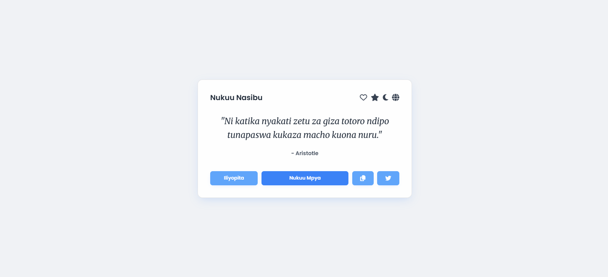
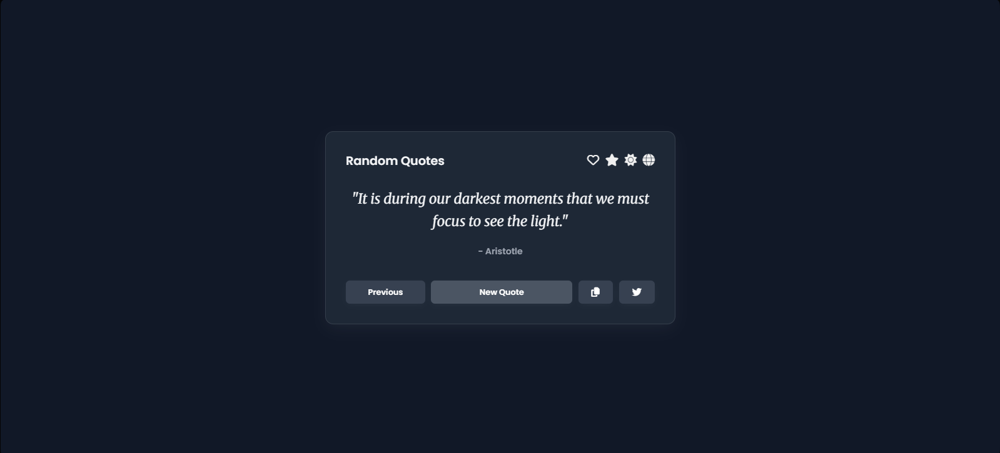

# Random Quote Generator

> A web application that displays random quotes. Users can discover new quotes, learn about the authors, and share their favorite quotes on social media. Built with a focus on clean code. This project uses vanilla technologies (HTML, CSS, and JavaScript).

**[View Live Demo Here](https://quote-generator-orpin-two.vercel.app)**

---

## Screenshots




---

## Features

- **Multi-Language Support**:
  - Toggle between English and Swahili with a single click.
  - The entire UI, including quotes, author details, and button text, updates instantly.
  - The user's language preference is saved in localStorage for their next visit.
- **Dynamic Quote Loading**: Quotes and their translations are fetched asynchronously from an external `quotes.json` file (keeps data and logic separate).
- **Dark/Light Mode**: A theme toggle (🌙/🌞) allows users to switch between a clean light theme and an eye-friendly dark theme. The user's preference is saved in `localStorage`.
- **Quote History**: Never lose a great quote again! Users can click the "Previous" button to revisit the last few quotes they've viewed.
- **Favorite Quotes System**:
  - Users can "like" a quote by clicking the heart icon (♥️), saving it to a personal favorites list.
  - Can save English and Swahili versions of the same quote separately.
  - The heart icon (♥️) accurately reflects the favorite status for the currently viewed language.
  - All favorite quotes are stored persistently in `localStorage` and are vieweble in a dedicated modal.
  - A dedicated modal allows users to view and manage their collection of saved quotes.
- **Interactive Author Information**:
  - Click on an author's name to open a detailed modal with their biography, title, and lifespan.
  - The modal includes a direct link to the author's Wikipedia page for further reading.
  - Country flags link to the respective Wikipedia pages and can handle multiple nationalities.
- **Modern UI & UX**:
  - **Animations**: Subtle fade transitions for new quotes, a scale-up effect for modals, and hover micro-interactions on buttons create a fluid user experience.
  - **Typography**: Uses Google Fonts (Merriweather and Poppins) for high readability and aesthetic appeal.
  - **Design**: Features a modern card-based design with soft shadows and a cohesive color palette for both light and dark themes.
- **Responsive & Accessible**:
  - The layout is fully responsive and looks great on all devices, from mobile phones to desktops.
  - ARIA roles and keyboard navigation (e.g., `Esc` to close modals) are implemented for better accessibility.
- **Shareability**:
  - **Copy to Clipboard**: Easily copy the current quote with a single click.
  - **Tweet a Quote**: The "Tweet" button opens Twitter with the quote pre-populated and ready to share.

---

## Built With

This project was built from the ground up using only fundamental web technologies, with **no frameworks or libraries**.

- **Vanilla HTML5**: For semantic structure and content.
- **Vanilla CSS3**: For all styling, including:
  - Flexbox for responsive layouts.
  - CSS Variables (Custom Properties) for powerful and easy theming.
  - Transitions and animations for a dynamic feel.
- **Vanilla JavaScript (ES6+)**: For all application logic including:
  - `fetch()` API for asynchronous data loading.
  - `async/await` syntax for cleaner asynchronous code.
  - DOM manipulation to dynamically update content.
  - `localStorage` API for saving user preferences (theme, favorites).
  - `navigator.clipboard` API for the copy-to-clipboard functionality.

---

## Getting Started

To get a local copy up and running, follow these steps.

### Prerequisites

You only need a modern web browser.

### Installation

1.  Clone the repository to your local machine:
    ```bash
    git clone [https://github.com/Ogenche/quote-generator.git](https://github.com/Ogenche/quote-generator.git)
    ```
2.  Navigate to the project directory:
    ```bash
    cd quote-generator
    ```
3.  Open the `index.html` file in your browser. That's it!

---

## How to Use

### English

- Upon loading, a random quote is displayed.
- Click **New Quote** to see another random quote.
- Click **Previous** to go back to the last quote you viewed.
- Click the **Copy** icon to save the quote to your clipboard.
- Click the **Tweet** icon to share the quote on Twitter/X.
- Click the globe icon (🌍) to switch between English and Swahili.
- Click the theme icon (🌙/🌞) in the top-right to switch between dark and light mode.
- Click the heart icon (♥️) to add or remove the current quote from your favorites.
- Click the star icon (⭐) to view your list of saved favorite quotes.
- Click the author's name to learn more about them in a popup window.

### Swahili

- Ukurasa unapofunguka, nukuu nasibu huonyeshwa.
- Bonyeza **Nukuu Mpya** kuona nukuu nyingine nasibu.
- Bonyeza **Iliyopita** kurudi kwenye nukuu uliyoiona mwisho.
- Bonyeza ikoni ya **Kunakili** kunakili nukuu kwenye clipboard yako.
- Bonyeza ikoni ya **Twitter** kushiriki nukuu kwenye Twitter/X.
- Bonyeza ikoni ya dunia (🌍) kubadilisha kati ya Kiingereza na Kiswahili.
- Bonyeza ikoni ya mandhari (🌙/🌞) upande wa juu kulia kubadilisha kati ya mandhari ya giza na angavu.
- Bonyeza ikoni ya moyo (♥️) kuongeza au kuondoa nukuu kwenye orodha yako ya vipendwa.
- Bonyeza ikoni ya nyota (⭐) kuona orodha yako ya nukuu ulizohifadhi kama vipendwa.
- Bonyeza jina la mwandishi kujifunza zaidi kumhusu kwenye kidirisha cha arifa.
